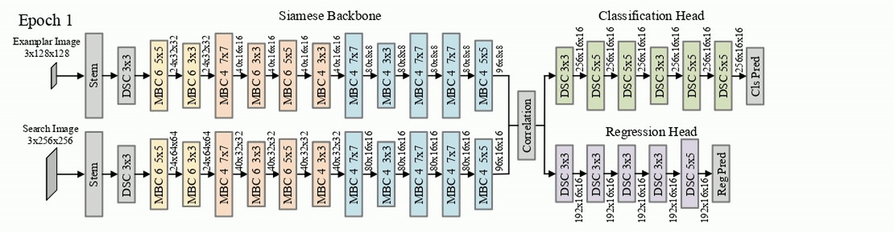

# LightTrack: Finding Lightweight Neural Networks for Object Tracking via One-Shot Architecture Search

<div align="center">
  
</div>

## Environment Installation
```
cd lighttrack
conda create -n LightTrack python=3.6
conda activate LightTrack
bash install_env.sh
```
## Data Preparation

- ImageNet

Please first download the [ImageNet-2012](http://www.image-net.org/) then unzip it to the folder `$LightTrack/supernet_backbone/data/imagenet` and move the validation set to the subfolder `$LightTrack/supernet_backbone/data/imagenet/val`. To move the validation set, you cloud use the following script: <https://raw.githubusercontent.com/soumith/imagenetloader.torch/master/valprep.sh>

The prepared ImageNet dataset should look like:
```
$LightTrack/supernet_backbone/data/imagenet/train
$LightTrack/supernet_backbone/data/imagenet/val
...
```
- Tracking Training Set

Please download training data from [GoogleDrive](https://drive.google.com/drive/folders/1ehjVhg6ewdWSWt709zd1TkjWF7UJlQlq?usp=sharing), and then unzip them into `$LightTrack/data`.
The prepared tracking training set should look like:
```
$LightTrack/data/got10k
$LightTrack/data/y2b
$LightTrack/data/vid
$LightTrack/data/det
$LightTrack/data/coco
```
- Tracking Validation Set (for evolutionary search)

In this work, we choose GOT-10K val set as the tracking validation set. Please download it from [GOT10K-Val](http://got-10k.aitestunion.com/downloads_dataset/val_data) then unzip it into `$LightTrack/GOT-10K`. 
The prepared tracking validation set should look like:
```
$LightTrack/GOT-10K/val/GOT-10K_Val_000001
$LightTrack/GOT-10K/val/GOT-10K_Val_000002
...
```
- Tracking Benchmarks

Please put VOT2019 dataset under `$LightTrack/dataset`. The prepared data should look like:
```
$LighTrack/dataset/VOT2019.json
$LighTrack/dataset/VOT2019/agility
$LighTrack/dataset/VOT2019/ants1
...
$LighTrack/dataset/VOT2019/list.txt
```
## LightTrack Pipeline

- Step1: Pretraining Backbone Supernet
```
cd supernet_backbone
chmod +x tools/distributed_supernet.sh
bash experiments/supernet_pretrain.sh
cd ..
```
- Step2: Training Tracking Supernet
```
python tracking/onekey_X_supernet_simple.py --cfg experiments/train/supernet_train.yaml --WORK_DIR . --back_super_dir supernet_backbone/experiments/search/hypernet
```
- Step3: Searching with Evolutionary Algorithm on Tracking Supernet
```
bash Evolution/src/Search/search.sh
```
## Flops, Params, and Speed
Compute the flops and params of our LightTrack-Mobile. The flops counter we use is [pytorch-OpCounter](https://github.com/Lyken17/pytorch-OpCounter)
```
python FLOPs_Params.py
```
Test the running speed of our LightTrack-Mobile
```
python Speed.py
```

## Test and evaluation
Test LightTrack-Mobile on VOT2019
```
bash reproduce_vot2019.sh
```
